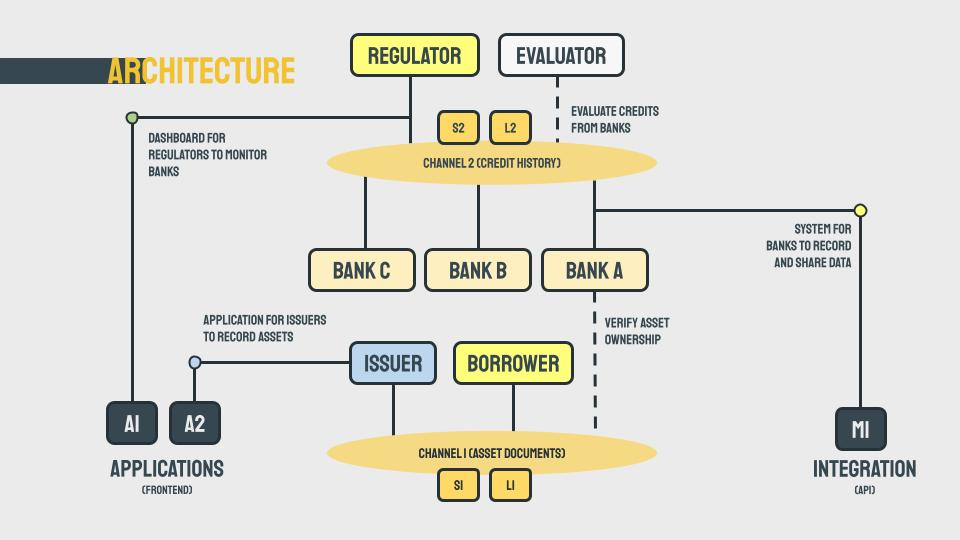
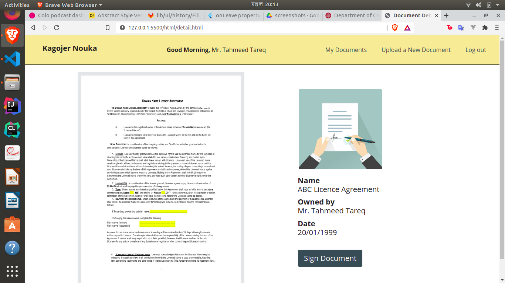
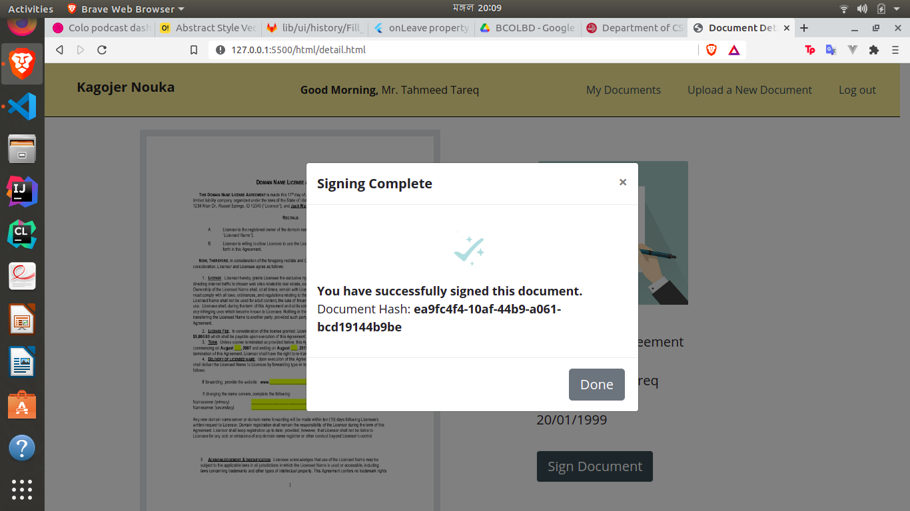
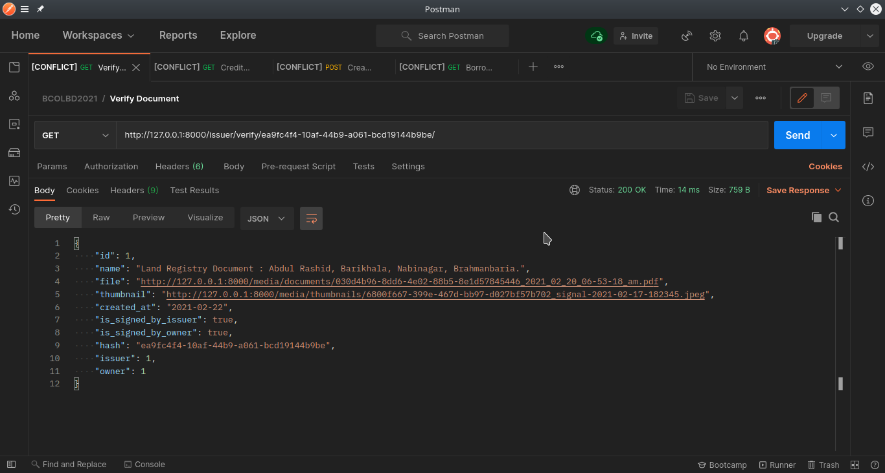
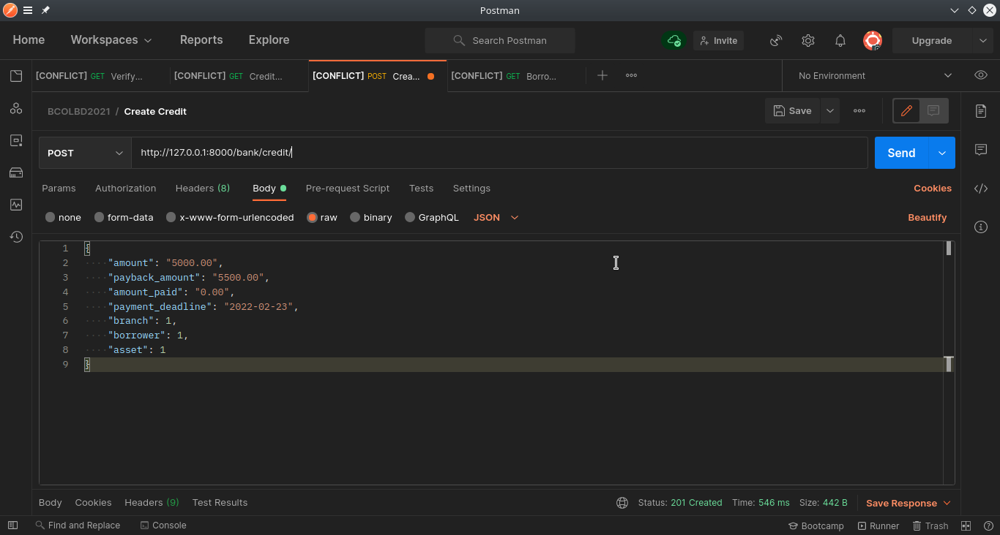
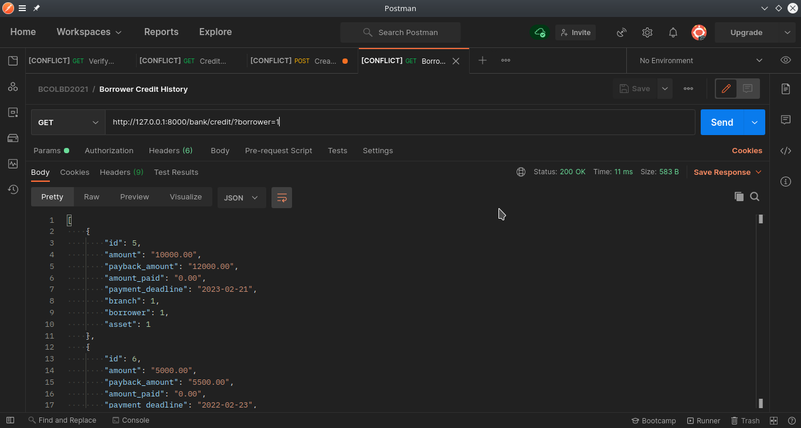
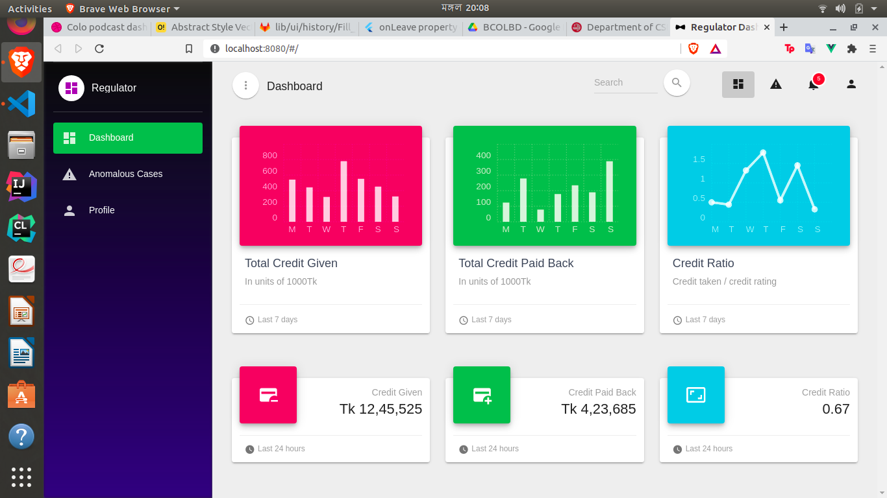

# Bangladesh Blockchain Olympiad 2021, Team Kagojer Nouka

Being a rapidly growing economy one of the barriers that is holding Bangladesh back is the lack of a strong and sustainable financial system. Two core reasons which led us here are the lack of participation of general people specially from people of marginal and underprivileged communities and the lack of accountability in the lending process leading to corruptions and inefficiencies. We have proposed a solution to this problem, using Hyperledger Fabric blockchain, that brings all entities relevant to the lending process together, providing them with tools to do it more efficiently with lower risks and enabling collaboration to ensure collective benefit. As doing something through regulatory changes is often difficult and unsustainable, we designed our system with the goal of satisfying mutual interests and a fair incentive structure for all the parties. We primarily focus on documenting two sections of the lending process which are the credit history of a borrower and verifiable ownership of assets by bringing issuers, lenders, borrowers and regulators into our system increasing efficiency and accountability at each stage which ultimately leads to more sustainable economic growth.

<<<<<<< HEAD

## Current Scenario

Bangladesh is one of the fastest growing economies of the world right now. In order to sustain the growth, we need to ensure access to the services provided by a functioning and reliable financial sector to every citizen of the country. Although the banking sector provides various other services, the banks have two core jobs - helping people to safely save who have surplus money and lending that money to people who need it. Although there are issues with helping people save and invest their extra money in the economy, the lending process has some bigger issues that require more focused attention. Therefore, we will only focus on the lending process in this white paper.
One of the biggest problems with the lending process is that the formal banking sector can’t reach most people of the country. A survey conducted jointly by the International Food Policy Research Institute (IFPRI) and the Bangladesh Institute of Development Studies (BIDS) revealed that 62 per cent of rural households obtained loans from informal sources and most of whom are smaller landowning groups. Only 14 percent of rural households could access loans from financial institutions that contributed to 25 percent of total loans received by rural households. Individual borrowers in the urban areas also face the same problems due to reasons explained later. This deprivation from access to a formal credit system makes them prey to various predatory practices like high interest rates, often as high as 10 percent per month. This puts already underprivileged people in a more disadvantaged position, and contributes to the increasing inequality of the country.

The other big problem plaguing this sector is that while banks are failing to lend money to the right people, they are also in trouble for lending money to the wrong people. The banking sector of Bangladesh is now facing a massive crisis regarding Non Performing Loans (NPLs). NPL is a loan that is in default or close to being in default which means they badly affect the health of the banking sector and also the economy of the nation. The international standard for NPL is 2 percent or below but in our country it is 5 to 6 times higher than the standard! According to Bangladesh Bank, 10.32 percent of total loans issued by banks in Bangladesh in December 2018 were non performing. If we narrow down our search to the state owned commercial banks and specialized banks, the situation becomes even more scary. State owned commercial banks had 23.86 percent and specialized banks had 15.10 percent of their total loans classified as NPL by Bangladesh Bank. However, many independent international organizations claim that this data is underreported. According to a report published by IMF, the amount of the defaulted loan in June 2019 was BDT 2,401.67 Billion (around one-fourth of all loans). According to the same report, the value of NPL has grown 417% in the last 10 years.

This high percentage of NPL is creating many problems for the banking sector of Bangladesh. NPL scams demolish the reputation and credibility thus negatively affect the share price of the bank. People gradually start losing their trust in banks. Credit and CAMELS (Capital adequacy, Asset quality, Management, Earnings, Liquidity, and Sensitivity) rating of the bank worsen. As the amount of NPL grows, banks have less money to invest. Banks become conservative while lending, which in turns decreases innovation and investment which harms the overall economy. Studies show that 1% increase in NPL ratio can lead to 0.1% less growth of GDP.

## Problem Identification

There are many reasons behind this low participation in the banking sector and recent exponential increase in NPL. They can be summarised as following:

1.  **Broken Asset Management System:** The process of collecting data about various kinds of collateral such as land property, letter of credit, bank deposit, insurance, income statements are all maintained via pen and paper. Most of the rural people don’t have easy and fast access to these documents. Bank officials have to manually check these assets for any irregularity in the application. This makes the process of evaluating the value of a collateral very inefficient, difficult in the rural areas and due to lack of enough man-power very lengthy and error-prone. It also increases the chance of corruption in the process leading to issuing a loan against a non-existent or overvalued collateral which in turn leads to the loan getting NPL.
2.  **Bad Governance and Corruption:** Bank directors and top-level executives are hardly accountable for their actions which enables corruption. They avail huge quantities of loans themselves with the intention of never paying back. Banks also give loans to people with questionable creditworthiness even without collaterals, compelled by pressure from powerful people, and compromising existing security standards.
3.  **No Standard Evaluation System:** Although banks manage their internal data about their borrowers, there is no unified way of getting the credit score of an individual borrower. Bangladesh currently has 8 credit rating companies in business that provide credit rating to various institutions and businesses. But they are not capable of meeting the demand of the whole sector. As a result, many loans are issued without proper checks about creditworthiness of the borrower.
4.  **Lack of Cooperation:** In the last few years, many new banks have entered the market densely concentrated in the city areas, but the capacity of the sector and the size of the skilled workforce hasn’t increased. This has led some of the new banks to have high NPL ratios. Many established banks are also suffering with the problem. This problem could have been solved if the banks could come together in building a system where they could share data efficiently. But as of today, no such system exists in Bangladesh.

## Solutions

### Lending Process

Whether or not a loan is qualified by banks can be determined by three simple questions:

1. What is your ability to pay?
2. What is your willingness to pay?
3. What happens if you don't pay?

A borrower proves their ability to pay by showing their current sources of income, their willingness is determined from their credit history and finally they provide some form of collateral in case they fail to pay back the loans. When we look deeply into the lending process we can primarily identify four separate categories of participants:

1. **Borrowers** like individuals or business owners who take the loan providing some collaterals
2. **Issuers** like the Land Registry, Income Tax or Insurance Agency who issue documents that verify the ownership of those collaterals
3. **Lenders** which are the Banks who lend borrowers loans against those collaterals based on certain conditions
4. **Regulators** who are government representatives like Bangladesh Bank who evaluate the debtors ability to pay back loans or the likelihood of defaults in loans

### Proposed System

Our plan is to firstly record assets issued as collaterals on a blockchain. The issuers document these assets and issue digital documents which can then be used by borrowers to prove ownership over those assets. Banks can then issue loans against secure collaterals, verify the values of these collaterals by appraisals and determine whether the borrower is eligible for the loan.

The loans issued by banks are also tracked in our system providing data for credit history of a borrower. This data can be shared among banks to maintain complete information about the credibility of borrowers.

### Why Does It Work?

We primarily focus on documenting two sections of the lending process which are the credit history of a borrower and the ownership of assets by the borrower. The benefits earned by different parties in this system are:

1. For issuers the immutability of the blockchain ensures that the data is incorruptible and thus safe from external influence, the process of digitally maintaining this data will also reduce their operational costs and make the ownership verification system more efficient and lastly distributed data sharing will allow other relevant parties to access this data without going through the issuers everytime.
2. Borrowers can now prove the ownership of their assets easily to any institution. They can also provide their credit history which would count significantly in securing a new loan.
3. Banks can use verified collaterals or even take temporary ownership of assets which secures the loan substantially. Each credit helps maintain a complete credit history of borrowers which other banks can utilize to determine credit-worthiness.
4. Moreover Credit Ratings Agencies can properly judge the quality of these loans and determine the likelihood of defaults. These ratings can then set a standard against which all banks are evaluated which will force banks to become more sincere in their lending process.
5. Regulators will have access to real time data about lending practices by banks and, in case of any suspicious activity, conduct investigations using verified data and hold the banks accountable.

All of these steps contribute greatly to making a more transparent lending system with established credibility for borrowers, fewer defaults and higher levels of accountability at each step.

### Why Blockchain?

The reason we have chosen a blockchain based solution instead of a simple cloud based application is because we want to utilize some fundamental properties that blockchain provide - data immutability to ensure the asset/loan data has not been tampered with, secure data sharing to improve collaboration between entities without compromising security and lastly data transparency for people who deserve a loan to prove their credit worthiness in a system which currently holds no such standards.

## Architecture

We work with issuers to document the assets digitally and provide a way for the owners to verify these assets to the bank. The bank then records loans against these collaterals and shares these with other banks, regulators and auditors.

### Choice of Blockchain

The use of blockchain ensures that the overseers get verified data and the integrity of data for owners is maintained. The most mature blockchain platforms are Etherium, Corda and Hyperledger. We had to go with a permissioned blockchain to allow private data channels to ensure privacy and access control features to restrict some participants from changing sensitive data. As Etherium is a public blockchain, we decided not to go with it. We also considered common applications like asset documentation and verification and enterprise data sharing and figured that Hyperledger Fabric satisfied all of our use cases. The Hyperledger ecosystem is the most mature among enterprise blockchains and also has the backing of big tech companies like the Linux Foundation and IBM. So we decided to build our application using Hyperledger Fabric considering all criterias.

### Integration with Existing Systems

Our system is not altering the current methodologies followed by our partners, instead we are just allowing them to integrate their current implementation with our system to make it more efficient and resourceful. We plan to help the issuers maintain their own documents digitally which they don’t currently do. The digitization of documents and using digital signatures for identities is a common solution implemented in many contexts and should not disrupt their current working model.

On the other hand most banks have some kind of existing legacy systems that they internally use to manage their workflow and record accounts, loans, transactions, credit history etc. They would have to update the system to record a transaction only after it has been accepted through consensus by the blockchain. They can interact with the blockchain using our API and only provide some necessary credit data determined by the government and then continue their regular workflow.



## Governance

In our system, we are digitally documenting assets like properties, insurance, business documents, etc. But the issuers are already keeping track of these data. As the concerning issuers are already reliably keeping record of the assets our model doesn’t require them to do anything more than just to keep the records digitally. We can also rely on them to represent assets faithfully and consistently on a blockchain by introducing members for oversight like regulators and credit ratings agencies.

### Network Membership Governance

1. **Member on and off boarding:** We plan to start with a single bank and the issuers their customers use to verify their collaterals. We will gradually bring more issuers into the system to use different kinds of collaterals. Other banks can also enter the system by agreeing to rules established on the network and getting permission from the regulatory agencies of the government.
2. **Data ownership:** In the system banks have full ownership over their client data and only share a part of it with regulators, auditors and other banks to determine loan and borrower credibility. Issuers also have control over their asset data and allow banks to only verify this data with them.
3. **Permission structure:** As issuers join the network, they consent to share (read-only) user asset data with banks and credit rating agencies at a cost bargained for collectively. Banks evaluate these assets and record their issued credits and then consent other banks, regulators and auditors to access (read-only) only the data deemed necessary by regulators.
4. **Regulatory oversight provisioning:** We allow regulators (Bangladesh Bank) to monitor the loans issued by each bank. They can also use auditors, credit rating agencies to evaluate the integrity of these loans and hold each bank accountable. Regulators are also in control of an ordering node and have the responsibility of resolving any conflicts that arise.

### Business Network Governance:

1. **SLA Management:** The banks, issuers and other entities all agree to share required data faithfully mentioned in the above points. While doing so, they will have to provide uptime of 99.5% (The Open Banking Implementation Entity standard), turn around time of less than a minute (should be renegotiated based on increasing complexity and technical advancements every quarter), Average time to answer in 5 minutes in case any problem occurs during the work hours. In case any entity fails to follow the agreement, the regulators can take punitive actions (fine, expulsion from the system or other legal actions).
2. **Legal and Regulatory Compliance:** Two kinds of institutions exist which have different kinds of regulation-- banks whose regulation is imposed upon by Bangladesh Bank which is also in the network and issuers who need to maintain asset ownership data transparently so borrowers can prove their ownerships. None of these sectors conflict with the other in any regulatory framework, so they can coexist.
3. **Business Operations Structure:** Banks are free to continue their own business, just sharing additional data determined by regulators. Most of the parties involved are government entities so business motives are not a primary concern.

### Technology Infrastructure Governance:

1. **Distributed IT Management Infrastructure:** In order to enforce easy and uniform IT experience, we will host the whole network on an agreed upon reputable cloud provider. The peer nodes are managed by the concerning entities i.e. bank, issuer and government. They will also manage the cost of managing the peer.
2. **Technology Assessment and Adoption:** A board of technical experts will be formed with representatives from various entities. They will periodically discuss new improvements and standards in the industries, security measures, and agree to standards to enforce on the system. They are then approved by regulators and then implemented at each level (banks, issuers). The standards will be enforced with the help network configurations & regulators.
3. **Data Entry:** Points of data entry are very crucial as it determines core points of failure for any secure blockchain. Our primary data sources are - 1. Asset documents recorded by issuers in the presence of owners and digital signature which ensure the integrity of the data then onwards and 2. Credit records from banks which are monitored by regulators to determine the integrity of loans issued and hold banks accountable. This ensures that at each point of data entry participants either don’t have the ability or incentive to cheat the system.
4. **Data On-Off Chain:** Documents are recorded off chain with their hashes embedded in each transaction with timestamp and digital signatures. Again banks keep most of their transaction data off-chain but only share some data in the blockchain which is necessary to determine reliability of a borrower e.g. previous loans, collaterals, returns on loans, etc.

## What This Prototype Does

You can watch our [prototype video]() if you want to see what have done so far. These are the points explained shortly.

### Issuer

Firstly, we have a web application to facilitate asset documentation. The issuer will take a photo of the document, which they then drag and drop into the corresponding file input section in the website. In this way, any legal asset document can be uploaded & essentially digitized. Next, asset owners can view their documents in this section. Some basic information such as ID, name, date is shown here along with a small preview of the document. The documents which have already been signed have the signed status here. The rest of the documents can be digitally signed by clicking this button which will take the owner to the details of the respective document. In the details page, a full preview of the document is provided. After clicking “sign document”, a confirmation dialogue will appear. At the successful completion of the document signing process, a document hash is shown which now represents the document in the blockchain.





### Bank

As almost all banks have their own existing systems, we provide APIs to integrate them with our system. When a person requests credit against an asset, he gives the corresponding hash to the bank. The bank makes a request to our server, and gets information about the document, and whether it is used in any other credits or not. If they agree to lending money, they let our system know that by making another POST request containing information about the credit. This data is used to create a unified credit history of the borrower, that the banks can use by requesting to the corresponding endpoint.







### Regulator

We have a separate private web application for regulators where they can view crucial information regarding the current lending practices of banks. The dashboard contains weekly and daily statistics of credit ratio & the amount of credit given / paid back to the banks, which will help the regulators determine the percentage of defaults. There’s also a section for anomalous cases which is meant to help regulators find out potential irregularities. It shows individual transaction records of irregular cases as well as an overview of how the banks are performing in terms of giving credit to borrowers.



## Project Structure

1. `docs/` contains various files submitted during the competetion.
2. `fabric/` contains codes related to the blockchain.
3. `issuer-frontend/` folder contains code regarding frontend.
4. `regulator-webapp/` contains the frontend for regulator.
5. `webserver/` contains the web server used to communicate with the blockchain and the frontends.

## Installation Guide

Please look at the seperate folders for information regarding how to run that specific project.

### Hyperledger

```bash

./network/network.sh up createChannel -c mychannel -ca
./network/network.sh deployCC -ccn basic -ccp ../chaincode/ -ccl javascript

```

## Team Members

1. Tahmeed Tarek
2. Kh. Ashiqur Rahman
3. Priyeta Saha
4. Md. Zunaed Karim
